# 🏗️ Phân Tích Kiến Trúc Claude Code — Chi Tiết

> [!NOTE]
> Đây là bản phân tích kiến trúc chi tiết của repository **claude-code** (github.com/anthropics/claude-code). Repository này là phần **open-source** của Claude Code — một công cụ agentic coding chạy trong terminal.

---

## 1. Tổng Quan High-Level

Claude Code là một agentic coding tool sống trong terminal, hiểu codebase, và giúp code nhanh hơn thông qua natural language commands. Repository open-source này **không chứa source code chính** (core runtime) mà tập trung vào:
- **Plugin ecosystem** — Hệ thống mở rộng chức năng
- **CI/CD automation** — Tự động hóa quản lý GitHub issues
- **DevContainer sandbox** — Môi trường phát triển an toàn
- **Enterprise deployment** — MDM & Settings templates
- **Examples & Documentation** — Hướng dẫn cho developer

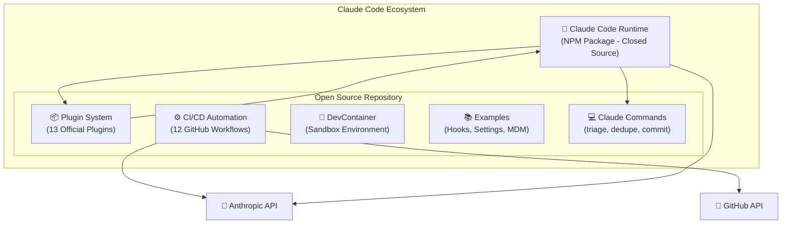

---

## 2. Kiến Trúc Plugin System

### 2.1 Plugin Architecture Overview

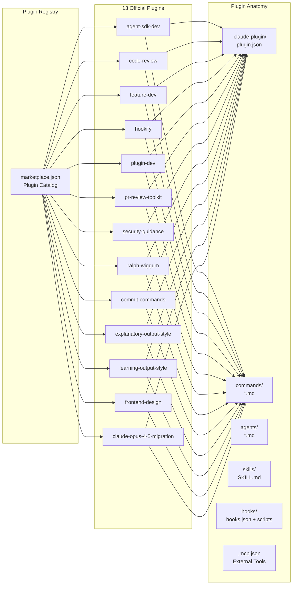

### 2.2 Plugin Component Hierarchy

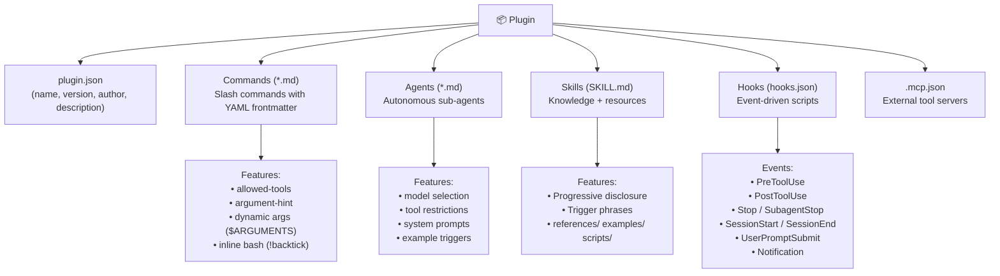

### 2.3 Plugin Classification

| Category | Plugins | Mục đích |
|----------|---------|----------|
| **Development** | agent-sdk-dev, feature-dev, plugin-dev, frontend-design, claude-opus-4-5-migration | Hỗ trợ phát triển code & plugins |
| **Productivity** | code-review, commit-commands, hookify, pr-review-toolkit | Tự động hóa workflow |
| **Learning** | explanatory-output-style, learning-output-style | Giáo dục & interactive learning |
| **Security** | security-guidance | Bảo mật code |
| **Advanced** | ralph-wiggum | Self-referential AI loops |

---

## 3. CI/CD & Issue Automation Pipeline

### 3.1 GitHub Workflows Architecture

```mermaid
flowchart TD
    subgraph "Issue Lifecycle Automation"
        NEW["🆕 New Issue Opened"]
        NEW --> TRIAGE["claude-issue-triage.yml<br/>AI-powered triage<br/>(Claude Opus 4.6)"]
        TRIAGE --> LABELS["Apply Labels<br/>(bug, enhancement, question,<br/>needs-repro, needs-info)"]
        
        NEW --> DEDUPE["claude-dedupe-issues.yml<br/>Duplicate detection<br/>(Claude Sonnet 4.5)"]
        DEDUPE --> DUPECHECK{"Duplicates Found?"}
        DUPECHECK -->|Yes| COMMENT["Post duplicate comment"]
        DUPECHECK -->|No| SKIP["Skip"]
        
        COMMENT --> WAIT["⏳ Wait 3 days"]
        WAIT --> AUTOCLOSE["auto-close-duplicates.yml<br/>Auto-close if no objection"]
    end
    
    subgraph "Lifecycle Management"
        SWEEP["sweep.yml (Daily)<br/>Mark stale issues"]
        SWEEP --> STALE["Label: stale<br/>(30d inactive)"]
        STALE --> CLOSE["Auto-close<br/>(after timeout)"]
        
        LOCK["lock-closed-issues.yml (Daily)<br/>Lock resolved issues<br/>(7d after close)"]
    end
    
    subgraph "Claude Integration"
        MENTION["@claude mention<br/>(issues/PRs/reviews)"]
        MENTION --> CLAUDE_ACTION["claude.yml<br/>claude-code-action@v1"]
    end
    
    subgraph "Stats & Logging"
        LOG["log-issue-events.yml<br/>→ Statsig Analytics"]
    end
```

### 3.2 Issue Lifecycle State Machine

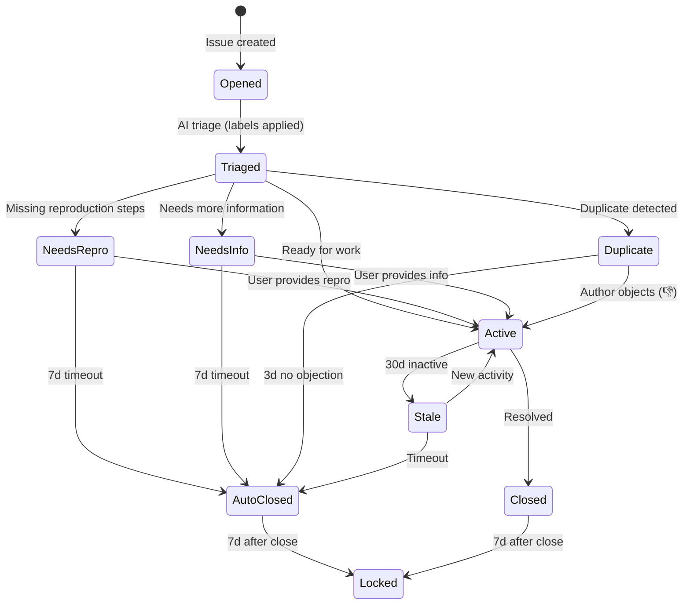

---

## 4. DevContainer & Security Architecture

### 4.1 Sandbox Environment

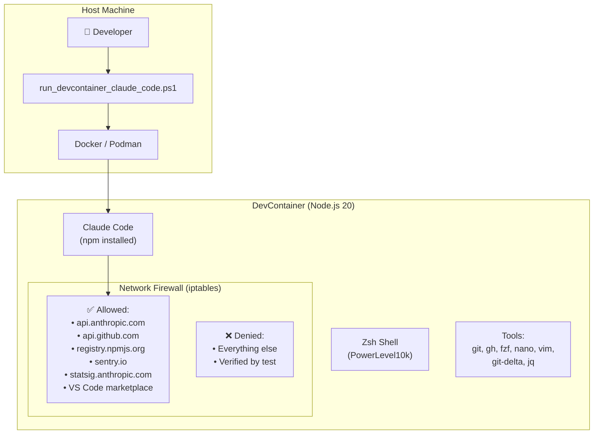

### 4.2 Firewall Security Flow

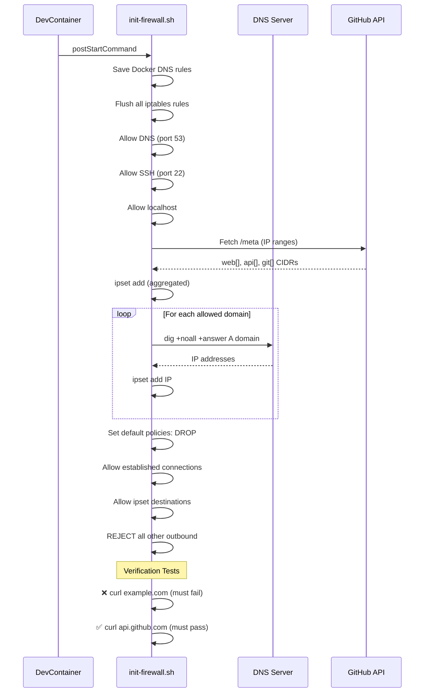

---

## 5. Enterprise Deployment Architecture

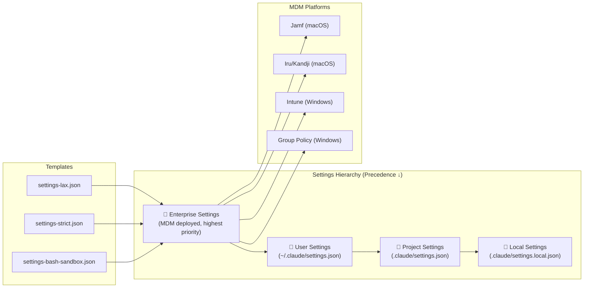

---

## 6. Data Flow — Code Review Plugin (Deep Dive)

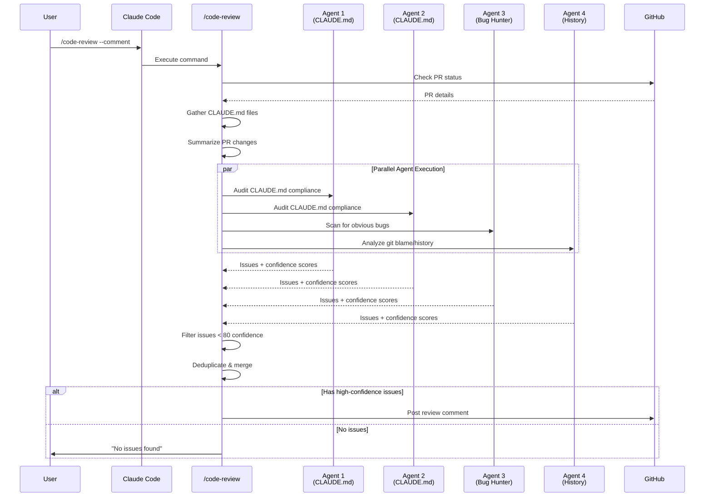

---

## 7. Feature Dev Plugin — 7-Phase Workflow

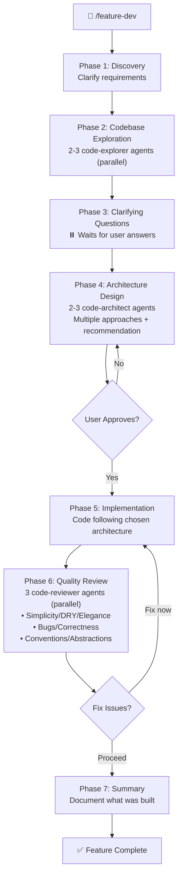

---

## 8. Ralph Wiggum — Self-Referential Loop Architecture

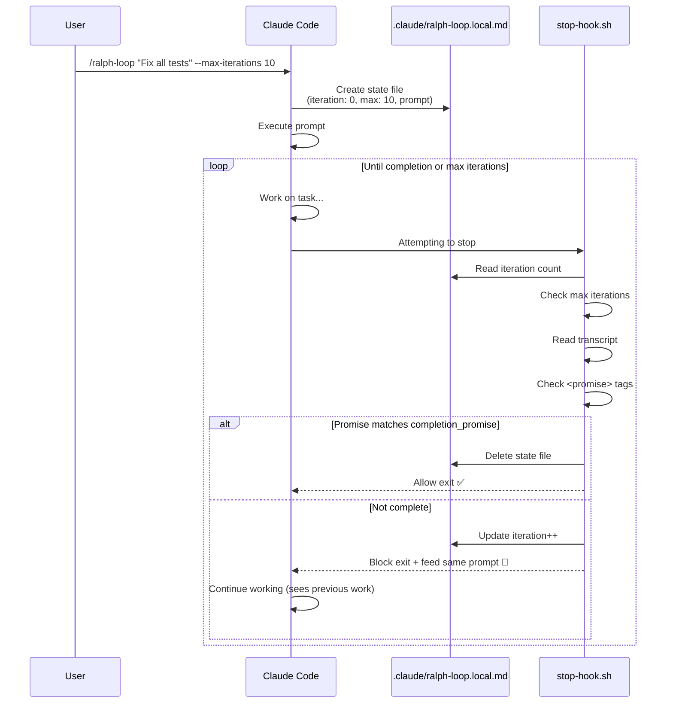

---

## 9. Hookify — Dynamic Rule Engine

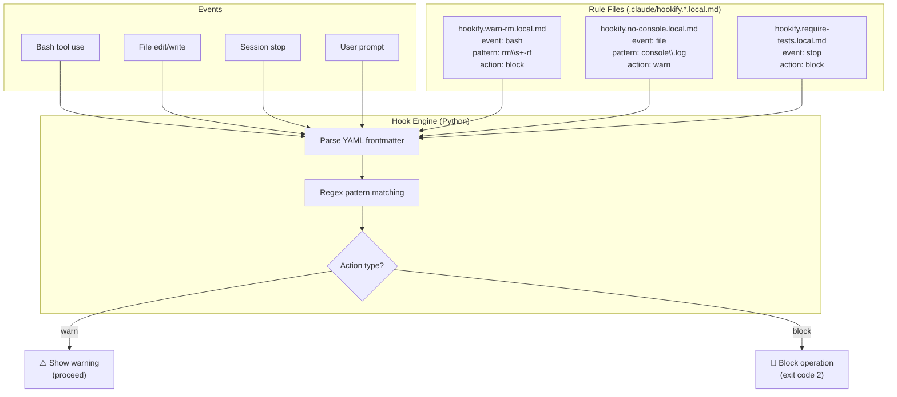

---

## 10. Security Guidance Plugin — Pattern Matching

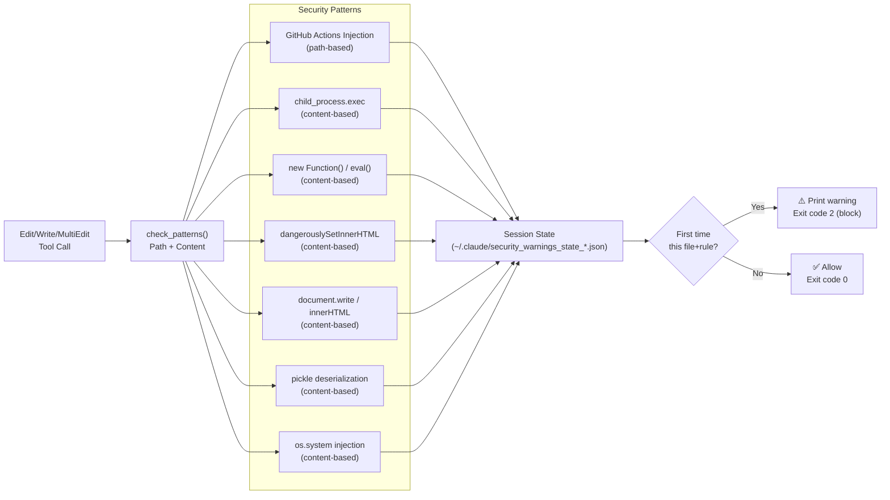

---

## 11. File Structure Summary

```
claude-code/
├── .claude/                          # Claude Code configuration
│   └── commands/                     # Repository-level slash commands
│       ├── triage-issue.md           # AI-powered issue triage
│       ├── dedupe.md                 # Duplicate issue detection
│       └── commit-push-pr.md        # Git workflow automation
│
├── .claude-plugin/                   # Marketplace configuration
│   └── marketplace.json              # Plugin catalog (13 plugins)
│
├── .devcontainer/                    # Sandboxed development environment
│   ├── Dockerfile                    # Node.js 20 + tools
│   ├── devcontainer.json             # VS Code + container config
│   └── init-firewall.sh             # Network isolation (iptables)
│
├── .github/                          # GitHub automation
│   ├── workflows/                    # 12 CI/CD workflows
│   │   ├── claude.yml                # @claude mention handler
│   │   ├── claude-issue-triage.yml   # AI issue triage
│   │   ├── claude-dedupe-issues.yml  # Duplicate detection
│   │   ├── lock-closed-issues.yml    # Auto-lock after 7d
│   │   ├── sweep.yml                 # Stale issue management
│   │   └── ... (7 more workflows)
│   └── ISSUE_TEMPLATE/              # Bug, feature, docs templates
│
├── scripts/                          # Automation scripts
│   ├── gh.sh                        # Sandboxed GitHub CLI wrapper
│   ├── auto-close-duplicates.ts     # Auto-close duplicate issues
│   ├── sweep.ts                     # Stale issue lifecycle
│   └── ... (5 more scripts)
│
├── plugins/                          # 13 Official Plugins
│   ├── agent-sdk-dev/               # Agent SDK development
│   ├── code-review/                 # Multi-agent PR review
│   ├── feature-dev/                 # 7-phase feature workflow
│   ├── hookify/                     # Dynamic rule engine
│   ├── plugin-dev/                  # Plugin development toolkit
│   ├── pr-review-toolkit/           # 6 specialized reviewers
│   ├── security-guidance/           # Security pattern detection
│   ├── ralph-wiggum/                # Self-referential AI loops
│   ├── commit-commands/             # Git workflow commands
│   ├── explanatory-output-style/    # Educational insights
│   ├── learning-output-style/       # Interactive learning
│   ├── frontend-design/             # Design quality guidance
│   └── claude-opus-4-5-migration/   # Model migration tool
│
├── examples/                         # Reference implementations
│   ├── hooks/                       # Hook examples
│   ├── settings/                    # Enterprise settings templates
│   └── mdm/                        # MDM deployment templates
│
├── Script/                           # Windows automation
│   └── run_devcontainer_claude_code.ps1
│
└── README.md                        # Project documentation
```

---

## 12. 📊 Đánh Giá: Điểm Hay & Chưa Hay

### ✅ Điểm Hay (Strengths)

#### 🏆 1. Plugin Architecture — Thiết kế extensibility xuất sắc
- **Modular & Composable**: Mỗi plugin là một đơn vị độc lập với `plugin.json`, commands, agents, skills, hooks — tuân theo **Single Responsibility Principle**.
- **Progressive Disclosure**: Skill system sử dụng 3 tầng thông tin (metadata → SKILL.md → references) giúp AI agent chỉ load thông tin cần thiết, tiết kiệm context window.
- **Convention over Configuration**: Cấu trúc thư mục plugin được chuẩn hóa, auto-discovery tự động tìm components.

#### 🏆 2. Multi-Agent Architecture — Parallel agent execution
- **Code Review**: 4 agents chạy song song, mỗi agent đảm nhiệm một khía cạnh (CLAUDE.md compliance, bug detection, git history).
- **Feature Dev**: 7-phase workflow với các agent chuyên biệt (code-explorer, code-architect, code-reviewer) — mô phỏng tốt quy trình phát triển phần mềm thực tế.
- **Confidence-based Scoring**: Hệ thống điểm 0-100 để lọc false positives — cách tiếp cận thông minh giảm noise.

#### 🏆 3. DevContainer Sandbox — Security-first mindset
- **Network Isolation**: Firewall chỉ cho phép kết nối đến danh sách domains được phê duyệt (Anthropic API, GitHub, npm).
- **Verification**: Tự động test firewall bằng cách thử kết nối đến `example.com` (phải fail) và `api.github.com` (phải pass).
- **Defense in Depth**: Kết hợp iptables + ipset + DNS resolution + CIDR aggregation.

#### 🏆 4. Issue Lifecycle Automation — AI-powered DevOps
- **End-to-end automation**: Từ issue creation → triage → duplicate detection → stale management → auto-close → lock.
- **Human-in-the-loop**: Duplicate detection cho user 3 ngày để phản đối (thumbs down reaction) trước khi auto-close.
- **Statsig Analytics**: Tích hợp logging metrics để đo hiệu quả automation.

#### 🏆 5. gh.sh — Secure CLI Wrapper
- **Command allowlisting**: Chỉ cho phép `issue view/list`, `search issues`, `label list` — ngăn chặn Claude thực hiện các thao tác nguy hiểm.
- **Input validation**: Kiểm tra CIDR format, issue number, search query qualifiers.
- **Flag filtering**: Chỉ cho phép `--comments`, `--state`, `--limit`, `--label`.

#### 🏆 6. Ralph Wiggum — Innovative pattern
- **Self-referential loop**: Claude thấy kết quả của lần iteration trước qua files và git history.
- **Completion Promise**: Mechanism để AI tự thoát loop khi task hoàn thành — tránh infinite loop.
- **Robust error handling**: Validate mọi field trong state file, graceful degradation khi corrupt.

#### 🏆 7. Hookify — No-code rule engine
- **Markdown-first**: Rules được viết bằng markdown với YAML frontmatter — developer-friendly.
- **Instant effect**: Rules có hiệu lực ngay, không cần restart.
- **Flexible events**: Hỗ trợ bash, file, stop, prompt, all events.

#### 🏆 8. Enterprise-Ready
- **MDM Support**: Templates cho Jamf, Kandji, Intune, Group Policy.
- **Settings Hierarchy**: Enterprise → User → Project → Local với precedence rõ ràng.
- **Security Policies**: `disableBypassPermissionsMode`, `allowManagedHooksOnly`, `strictKnownMarketplaces`.

---

### ⚠️ Điểm Chưa Hay (Weaknesses)

#### ❌ 1. Thiếu Core Source Code — Black Box Problem
- Repository chỉ chứa plugins và automation, **không có source code chính** của Claude Code runtime.
- Developer không thể debug, audit, hoặc contribute vào core functionality.
- Plugin API documentation nằm ngoài repo (trên docs site), khó tham khảo khi offline.

#### ❌ 2. Thiếu Testing Infrastructure
- **Không có test suite**: Không có unit tests, integration tests, hoặc E2E tests cho plugins.
- **Không có CI cho plugins**: Workflows chỉ phục vụ issue management, không validate plugin code.
- **Manual verification**: plugin-dev có validate scripts nhưng không tích hợp vào CI pipeline.

#### ❌ 3. TypeScript + Bun dependencies chưa rõ ràng
- Scripts sử dụng `#!/usr/bin/env bun` (auto-close-duplicates.ts, sweep.ts) nhưng không có `package.json` hoặc dependency management.
- Thiếu `tsconfig.json` cho type checking.
- Import paths giữa scripts có coupling ẩn (`sweep.ts` import từ `issue-lifecycle.ts`).

#### ❌ 4. Inconsistent Code Quality across plugins
- **Không có linting/formatting standards**: Một số plugins dùng Python (security-guidance, hookify), các plugins khác dùng Bash (ralph-wiggum), không có shared coding standard.
- **Thiếu type safety**: Hook scripts đọc JSON từ stdin không có schema validation (trừ security-guidance).
- **Duplicate code**: `githubRequest()` function bị duplicate giữa `auto-close-duplicates.ts` và `sweep.ts`.

#### ❌ 5. Security Guidance Plugin — Limitations
- **Substring matching chỉ**: Không dùng AST parsing → false positives khi `eval` xuất hiện trong comments hoặc string literals.
- **Fixed patterns**: Không extensible — phải sửa source code để thêm pattern mới.
- **Single-language focus**: Chủ yếu cover JavaScript/TypeScript/Python, thiếu Go, Rust, Java patterns.
- **Session state leak**: State files lưu trong `~/.claude/` có thể tích lũy (cleanup chỉ chạy 10% probability).

#### ❌ 6. Hookify — Scalability Concerns
- **File-based rules**: Mỗi rule là một `.local.md` file — khi có nhiều rules, quản lý khó khăn.
- **Python regex only**: Không hỗ trợ glob patterns hoặc AST-based matching.
- **No rule composition**: Không thể kết hợp rules theo logic AND/OR phức tạp (chỉ AND giữa conditions).

#### ❌ 7. DevContainer — Local-only
- **Chỉ hỗ trợ local development**: Không có cloud/remote devcontainer support.
- **DNS-based firewall**: IP addresses có thể thay đổi, DNS resolution tại build time có thể outdated.
- **Không support IPv6**: Chỉ sử dụng `hash:net` với IPv4 CIDRs.

#### ❌ 8. Documentation Gaps
- **Thiếu CONTRIBUTING.md**: Không có hướng dẫn contribute cho community.
- **Thiếu architecture docs**: Không có ADR (Architecture Decision Records).
- **Plugin API contract**: Không có formal specification cho hook input/output format — chỉ có examples.
- **Changelog dài nhưng không structured**: 223KB changelog file, khó tìm breaking changes.

#### ❌ 9. Cross-Platform Issues
- **init-firewall.sh** chỉ chạy trên Linux (iptables) — không support macOS/Windows natively.
- **PowerShell script** (`run_devcontainer_claude_code.ps1`) là Windows-only, thiếu equivalent cho macOS/Linux.
- **Bash scripts trong plugins** có thể gặp lỗi trên Windows (mặc dù chạy trong container).

#### ❌ 10. Marketplace Architecture Concerns
- **marketplace.json** là static file — không có versioning strategy cho individual plugins.
- **Không có plugin dependency management**: Plugins không thể declare dependencies lẫn nhau.
- **Không có plugin isolation**: Tất cả plugins share cùng runtime context, một plugin lỗi có thể ảnh hưởng khác.

---

## 13. 📌 Tổng Kết

| Aspect | Rating | Comment |
|--------|--------|---------|
| **Architecture Design** | ⭐⭐⭐⭐⭐ | Plugin system thiết kế rất tốt, modular, extensible |
| **Code Quality** | ⭐⭐⭐ | Inconsistent giữa plugins, thiếu standards |
| **Security** | ⭐⭐⭐⭐ | DevContainer sandbox tốt, nhưng pattern matching naive |
| **Testing** | ⭐⭐ | Gần như không có automated tests |
| **Documentation** | ⭐⭐⭐⭐ | README các plugin tốt, nhưng thiếu architecture docs |
| **CI/CD** | ⭐⭐⭐⭐⭐ | Issue lifecycle automation xuất sắc |
| **Enterprise Readiness** | ⭐⭐⭐⭐ | MDM support, settings hierarchy, security policies |
| **Innovation** | ⭐⭐⭐⭐⭐ | ralph-wiggum, hookify, multi-agent review — rất sáng tạo |

> [!IMPORTANT]
> **Key Takeaway**: Claude Code repository thể hiện kiến trúc plugin system rất mature và nhiều pattern sáng tạo (multi-agent, self-referential loops, dynamic rules). Tuy nhiên, nó cần cải thiện testing infrastructure, code quality consistency, và documentation kiến trúc để đạt production-grade open source standards.
